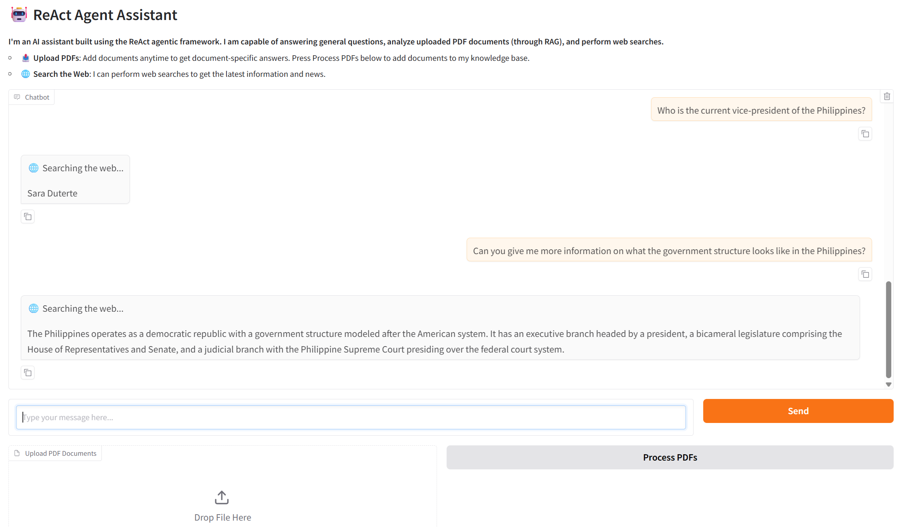

# 🤖 ReAct Agent Assistant

An intelligent AI assistant built with the **ReAct (Reasoning and Acting) agentic framework** using LangGraph, LangChain, and Gradio. The agent can reason about problems, take actions using tools, and provide intelligent responses based on document context and web information.



## Features

### 🤖 **ReAct Agent with Two Powerful Tools:**

1. **📚 Document Retrieval (RAG)**
   - Upload PDFs to build a knowledge base
   - Semantic search through uploaded documents
   - Uses ChromaDB for vector storage (ephemeral mode)
   - Powered by HuggingFace embeddings (BAAI/bge-small-en-v1.5)
   - Agent automatically retrieves relevant information from documents

2. **🌐 Web Search**
   - Real-time web search using Tavily API
   - Get current information and recent news
   - Advanced search depth for comprehensive results
   - Agent uses this tool for questions requiring current information

## Architecture

### **ReAct Framework**
The agent follows the ReAct pattern:
1. **Reason**: Analyzes the user's question
2. **Act**: Decides which tool to use (retrieve_documents or web_search)
3. **Observe**: Processes tool results
4. **Respond**: Provides an informed answer

### **File Structure:**
```
app/
├── tools.py       # Tool definitions (RAG retrieval, Web search)
├── agent.py       # LangGraph workflow and ReAct agent logic
└── app.py         # Gradio web interface

requirements.txt   # Python dependencies
.env              # Environment variables (create this)
Dockerfile        # Docker containerization
```

### **Technology Stack:**
- **LangGraph**: ReAct agent workflow orchestration
- **LangChain**: Tool integration and RAG pipeline
- **Gradio**: Web interface
- **ChromaDB**: Vector database for document storage (ephemeral)
- **Groq**: Fast LLM inference (llama-3.1-8b-instant)
- **Tavily**: Web search API
- **HuggingFace**: Embeddings model

## How to Access

You can run the ReAct Agent Assistant in three ways:

### 🚀 Option 1: HuggingFace Spaces (Quickest)

Try the live demo on HuggingFace Spaces:

[](https://huggingface.co/spaces/your-username/react-agent-assistant)

> **Note**: Replace the link above with your actual HuggingFace Spaces URL

### 🐍 Option 2: Run Locally with Python

#### Prerequisites
- Python 3.9 or higher
- API keys for Groq and Tavily

#### Steps

1. **Clone the repository**
```bash
git clone <your-repo-url>
cd job-application-assistant
```

2. **Create and activate virtual environment**
```bash
python -m venv venv
source venv/bin/activate  # On Windows: venv\Scripts\activate
```

3. **Install dependencies**
```bash
pip install -r requirements.txt
```

4. **Set up environment variables**

Create a `.env` file in the root directory:
```env
GROQ_API_KEY=your-groq-api-key-here
TAVILY_API_KEY=your-tavily-api-key-here
```

5. **Get API Keys**
   - **Groq API Key**: [Groq Console](https://console.groq.com/keys) (Free tier available)
   - **Tavily API Key**: [Tavily](https://tavily.com/) (Free tier available)

6. **Run the application**
```bash
python app/app.py
```

The application will be available at `http://localhost:7860`

### 🐳 Option 3: Run with Docker

#### Prerequisites
- Docker installed on your system

#### Steps

1. **Clone the repository**
```bash
git clone <your-repo-url>
cd job-application-assistant
```

2. **Create `.env` file**
```env
GROQ_API_KEY=your-groq-api-key-here
TAVILY_API_KEY=your-tavily-api-key-here
```

3. **Build the Docker image**
```bash
docker build -t react-agent-assistant .
```

4. **Run the container**
```bash
docker run -p 7860:7860 --env-file .env react-agent-assistant
```

The application will be available at `http://localhost:7860`

## Usage Guide

### Using the Assistant

Once the application is running, you can interact with the ReAct agent in multiple ways:

1. **💬 Chat Normally**: Ask general questions - the agent will answer directly or use tools as needed
2. **📤 Upload PDFs**: Click "Upload PDF Documents" and select files, then click "Process PDFs" to add them to the knowledge base
3. **🔍 Document Questions**: Ask questions about uploaded documents - the agent will use RAG retrieval
4. **🌐 Web Search**: Ask about current events - the agent will search the web using Tavily

### Example Interactions

**General Question (No Tools):**
```
You: What is machine learning?
Agent: [Answers directly from knowledge]
```

**Document Retrieval (RAG):**
```
You: What does the uploaded document say about neural networks?
Agent: 🔍 Searching through uploaded documents...
       [Retrieves and summarizes relevant content from PDFs]
```

**Web Search:**
```
You: What's the latest news about AI in 2025?
Agent: 🌐 Searching the web...
       [Uses Tavily to search and provides current information]
```

**Complex Query (Multi-tool):**
```
You: Compare the information in my document with current AI trends
Agent: 🔍 Searching through uploaded documents...
       🌐 Searching the web...
       [Combines information from both sources]
```

## How It Works

### ReAct Agent Workflow (LangGraph)

The agent follows a ReAct loop:

```
START → Agent (Reason) → Conditional Edge
                             ↓
                    [Tools (Act) | END]
                             ↓
                    Agent (Observe & Respond)
```

**Step-by-Step Process:**

1. **User Input** → Agent receives message
2. **Reasoning** → Agent analyzes the question and decides if tools are needed
3. **Action** → If needed, agent calls appropriate tool(s):
   - `retrieve_documents` for PDF content
   - `web_search` for current information
4. **Observation** → Agent processes tool results
5. **Response** → Agent formulates final answer based on reasoning and observations

### RAG Pipeline (Document Retrieval)

**Upload & Processing:**
1. User uploads PDF → PyMuPDFLoader extracts text with metadata
2. Text cleaned → Removes artifacts, normalizes formatting
3. Text chunked → RecursiveCharacterTextSplitter (500 chars, 150 overlap)
4. Embeddings created → HuggingFace BAAI/bge-small-en-v1.5
5. Stored in ChromaDB → Ephemeral (in-memory) vector database

**Query & Retrieval:**
1. Agent calls `retrieve_documents` tool with query
2. Query embedded → Same HuggingFace model
3. Semantic search → ChromaDB finds top-3 most relevant chunks
4. Results returned → With relevance scores and metadata
5. Agent synthesizes → Creates answer from retrieved context

### Tool Selection Logic

The ReAct agent autonomously decides which tool to use:
- **PDF/Document questions** → `retrieve_documents`
- **Current events/Recent info** → `web_search`
- **General knowledge** → Direct answer (no tool)
- **Complex queries** → Multiple tool calls as needed

## Project Structure

### **tools.py**
Contains the two ReAct agent tools and utility functions:

**Tools:**
- `retrieve_documents(query)`: RAG semantic search through uploaded PDFs
- `web_search(query)`: Tavily web search for current information

**Utility Functions:**
- `parse_pdf()`: Extract text from PDFs using PyMuPDFLoader
- `clean_text()`: Remove artifacts and normalize formatting
- `chunk_documents()`: Split documents using RecursiveCharacterTextSplitter
- `get_vectorstore()`: Initialize ChromaDB with HuggingFace embeddings
- `process_and_store_pdf()`: Complete pipeline from PDF to vector store

### **agent.py**
LangGraph ReAct agent implementation:
- **AgentState**: Manages conversation messages
- **agent_node**: Reasoning and tool selection
- **tool_node**: Executes selected tools
- **should_continue**: Conditional routing logic
- **Workflow**: ReAct loop with memory (MemorySaver)
- **System Message**: Guides agent behavior and tool usage

### **app.py**
Gradio web interface:
- Clean, simple chat interface
- PDF upload with processing
- Real-time upload status
- Streaming responses with tool indicators
- Message history
- Error handling with user-friendly messages

## Features in Detail

### 🤖 ReAct Agent
- **Autonomous reasoning**: Decides when and which tools to use
- **Transparent actions**: Shows tool usage indicators (🔍 for RAG, 🌐 for web search)
- **Conversational memory**: Maintains context across the conversation
- **Error handling**: Graceful fallbacks with user-friendly messages
- **Streaming responses**: Real-time display of agent thinking and results

### 📚 RAG (Retrieval-Augmented Generation)
- **Multiple PDF uploads**: Add as many documents as needed
- **Ephemeral storage**: In-memory ChromaDB (no persistence needed)
- **Semantic search**: Finds relevant content even with different wording
- **Automatic chunking**: Optimized chunk size (500 chars) with overlap (150 chars)
- **Metadata tracking**: Preserves source, page numbers, and relevance scores

### 🌐 Web Search
- **Real-time information**: Get the latest news and current events
- **Advanced search**: Deep search with comprehensive results
- **Integrated seamlessly**: Agent decides when to use based on query type
- **Tavily API**: Reliable and fast web search service

### 💬 Chat Interface
- **Simple and clean**: Default Gradio styling, easy to use
- **Streaming responses**: See agent responses as they're generated
- **Tool indicators**: Know when agent is searching documents or web
- **Upload anytime**: Add PDFs during conversation
- **Message history**: Full conversation context maintained

## Configuration

### Adjustable Parameters

**In `tools.py`:**
```python
# RAG Configuration
top_k = 3                           # Number of chunks to retrieve
chunk_size = 500                    # Characters per chunk
chunk_overlap = 150                 # Overlap between chunks
embedding_model = "BAAI/bge-small-en-v1.5"  # HuggingFace model

# Web Search Configuration
max_results = 1                     # Tavily search results
search_depth = "advanced"           # Search depth level
```

**In `agent.py`:**
```python
# LLM Configuration
model = "llama-3.1-8b-instant"     # Groq model
temperature = 0.4                   # Response creativity (0.0-1.0)
```

**In `app.py`:**
```python
# Server Configuration
server_name = "0.0.0.0"            # Listen on all interfaces
server_port = 7860                  # Port number
share = False                       # Set True for public link
```

## Troubleshooting

### Common Issues

**1. "GROQ_API_KEY environment variable is required" error**
- Ensure `.env` file exists in the root directory
- Verify API keys are correctly formatted (no quotes, spaces, or extra characters)
- Check file is named exactly `.env` (not `env.txt` or `.env.txt`)

**2. Import/Module errors**
- Run: `pip install -r requirements.txt`
- Ensure you're using Python 3.9 or higher
- Try creating a fresh virtual environment

**3. ChromaDB/Embeddings errors**
- First run downloads embeddings model (BAAI/bge-small-en-v1.5) - this is normal
- Ensure you have internet connection for first run
- May take a few minutes on first startup

**4. Docker issues**
- Ensure `.env` file exists before building
- Check Docker daemon is running
- Try: `docker logs <container-id>` for error messages

**5. "Tool use failed" errors**
- These are handled gracefully with user-friendly messages
- Usually occur with ambiguous queries - try rephrasing
- Check API keys are valid and have remaining quota

### Debug Mode

For verbose logging:
```bash
# Linux/Mac
export LANGCHAIN_VERBOSE=true
python app/app.py

# Windows PowerShell
$env:LANGCHAIN_VERBOSE="true"
python app/app.py
```

### Performance Tips

- **Ephemeral mode**: No persistence means documents need re-uploading after restart
- **Chunk size**: Smaller chunks (300-500) work better for specific questions
- **Temperature**: Lower (0.1-0.4) for factual, higher (0.6-0.9) for creative responses
- **Top-k**: Increase to 5-7 for broader context, decrease to 1-3 for focused answers

## Contributing

Contributions are welcome! Please feel free to submit a Pull Request. For major changes, please open an issue first to discuss what you would like to change.

## License

MIT License - see [LICENSE](LICENSE) file for details.

## Acknowledgments

- **LangChain & LangGraph**: For the excellent agent framework
- **Groq**: For fast and efficient LLM inference
- **Tavily**: For reliable web search API
- **Gradio**: For the easy-to-use web interface
- **HuggingFace**: For open-source embeddings models

---

**Built with ❤️ using the ReAct framework**
